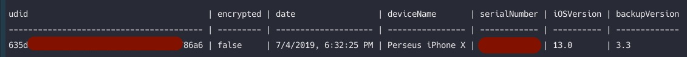
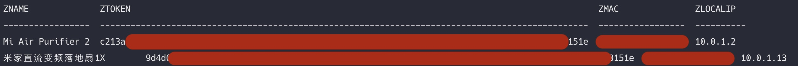
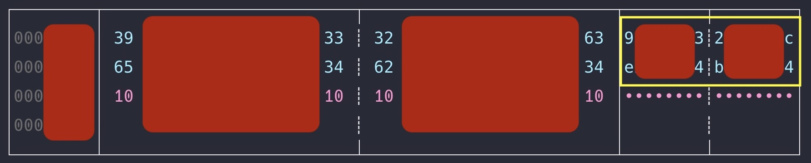

# Get Device Token Without Resetting on Non-Jailbroken iOS Devices

If you have devices already setup, their tokens could be hidden by default. In that case, if you want to get their tokens without setting them up one by one again, this document would show you the way. Because all the tokens are stored in a file named "######_mihome.sqlite"

## Step 1: Create an iOS Unencrypted Backup

## Step 2: Extract MiHome database

1. Install [iPhoneBackupTools](https://github.com/richinfante/iphonebackuptools) by [Rich Infante](https://github.com/richinfante)

```bash
npm i ibackuptool --save
```

2. Find the specific backup, we just need the udid

```bash
ibackuptool -l
```

the output would be something like this:



Specifically, we want the udid of the backup.

3. Extract the file "######_mihome.sqlite"

```bash
ibackuptool -b udid_from_step_3 -r backup.files --extract extraction_destination --filter "mihome.sqlite"
```

4. Locate the extracted file

```bash
cd extraction_destination/AppDomain-com.xiaomi.mihome/Documents
ls | grep mihome
```

## Step 3: Extract Tokens from MiHome database

1. Open the file in sqlite

```bash
sqlite3 77861590_mihome.sqlite
```

2. Adjust the options in sqlite3. These options are not necessary, but they do make the final output easier to read.

```bash
sqlite> .headers on
sqlite> .mode column
```

>"sqlite>" is the prompt in sqlite3, you only need to type what is after that

3. Extract the encrypted tokens

```bash
sqlite> select ZNAME, ZTOKEN, ZMAC, ZLOCALIP from ZDevice;
```



## Step 4: Decrypt Tokens

> Ref [Obtain MiHome Device Token](https://github.com/jghaanstra/com.xiaomi-miio/blob/master/docs/obtain_token.md)

1. The latest Mi Home app store the tokens encrypted into a 96 character key and require an extra step to decode this into the actual token. Visit [this](http://aes.online-domain-tools.com/) website and enter the details as shown below:
** __Input type:__ text
    * __Input text (hex):__ your 96 character key
    * __Selectbox Plaintext / Hex:__ Hex
    * __Function:__ AES
    * __Mode:__ ECB
    * __Key (hex):__ 00000000000000000000000000000000
    * __Selectbox Plaintext / Hex:__ Hex

2. Hit the decrypt button. Your token are the first two lines of the right block of code. These two lines should contain a token of 32 characters and should be the correct token for your device.

Alternatively, for step 2 of step 4, you can download the decrypted token (filename __odt-IV-00000000000000000000000000000000.dat__), then use a tool called [hexyl](https://github.com/sharkdp/hexyl), it can output the decrypted token in text, the website only displays it as an image, the font it used for the image output is a bit hard on the eye.

After you install **hexyl**, run the following command, then you can copen the decrypted token as text. No squinting required.

```bash
hexyl path-to-downloaded-file
```

the output would be like this



the token (32 characters) is the part enclosed in the yellow circle
